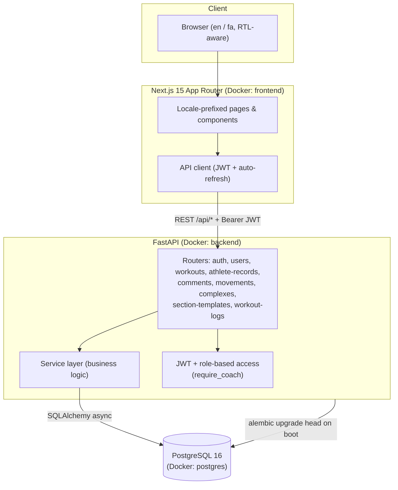

# FD Crossfit

FD Crossfit is a full-stack, bilingual (English / Farsi, with full RTL support) web platform for managing a CrossFit gym. It combines a public marketing site (home, about, coaches, pricing, contact) with an authenticated member/coach dashboard for daily workout programming, personal records, workout logging with leaderboards, and threaded Q&A on each day's workout. The backend is a FastAPI service backed by PostgreSQL; the frontend is a Next.js 15 App Router application. The whole stack is containerized with Docker Compose for local development.

## Features

### Public site
- Bilingual marketing pages: home, about, coaches, pricing, contact — with a language switcher and automatic RTL/LTR layout via `next-intl`.
- Coach spotlight and gym photo galleries with pointer-drag carousels.
- Success stories / member testimonials carousel.
- Contact page with a form (currently front-end only — see [Known Limitations](#known-limitations)).

### Authentication
- JWT-based auth with short-lived access tokens and longer-lived refresh tokens.
- Register / Login / Refresh endpoints; login accepts either email or username.
- Role-based access control: `member`, `coach`, `admin`, enforced via a `require_coach` dependency on coach/admin-only routes.
- Automatic access-token refresh on 401 responses from the frontend API client.

### Workout programming (coach/admin)
- Structured, multi-step workout section builder supporting four section types:
  - **Single Movement** — a single lift/skill with multiple weighted sets, rest, tempo, and RPE/effort/zone.
  - **Complex** — an ordered sequence of movements performed together, reusable via a searchable Complex library.
  - **Conditioning** — AMRAP, EMOM (with per-round interval groups), FOR TIME, RFT, TABATA, and CHIPPER formats, each with format-specific fields, configurable score targets, and ranking direction (higher/lower is better).
  - **Free Text** — unstructured notes (e.g. warm-ups).
- Reusable **Section Templates** coaches can save and re-load into the builder.
- A shared **Movement library** with debounced search, on-the-fly movement creation, and a "recently used" list.
- One workout per calendar day (JSONB-backed), editable and deletable by coaches/admins.

### Athlete/member tools
- Rolling day-picker dashboard (30-day forward window, expandable to 180 days forward / 90 days back) to browse and view scheduled workouts.
- **Personal records** log — a default CrossFit lift list plus custom exercises, stored per user.
- **Workout logging** — athletes log sets/reps/weight (or per-round values for EMOM), RPE/effort/zone, and a free-text note against each section of a workout.
- **Leaderboard** view for coaches — logs sorted by the workout's primary score target and ranking direction, with medal styling for the top 3.
- Threaded **comments/Q&A** under each workout — members can ask questions, reply, and coaches can moderate — with server-side rate limiting, duplicate-comment detection, profanity filtering, and HTML sanitization.

### Coach tools
- **Athlete roster** with debounced name/email/username search.
- Coach-side viewing and editing of any athlete's personal records.
- Full visibility into every athlete's workout log for a given day, with per-athlete drill-down.

## Tech Stack

**Frontend**
- Next.js 15 (App Router) + React 19, TypeScript
- Tailwind CSS
- `next-intl` for i18n and locale-prefixed routing (`en` / `fa`, RTL-aware)
- Custom `fetch`-based API client with automatic token refresh (`src/lib/api-client.ts`)

**Backend**
- FastAPI (Python 3.12)
- SQLAlchemy 2.0 (async, via `asyncpg`) + Alembic migrations
- Pydantic v2 for request/response schemas
- `python-jose` for JWT, `passlib`/`bcrypt` for password hashing
- Service-layer architecture: thin routers, business logic in `app/services/`, ORM models in `app/models/`

**Database**
- PostgreSQL 16, with `JSONB` columns used for flexible, per-record data (workout sections, athlete records, workout logs, complex movement lists)

**Infrastructure**
- Docker Compose — three services: `postgres`, `backend` (FastAPI + `alembic upgrade head` on boot), `frontend` (Next.js dev server)
- Backend container installs dependencies from `pyproject.toml`

**Other notable libraries**
- `httpx`, `python-multipart` (backend)
- Google Fonts (`Archivo Black`, `Inter`, `Vazirmatn`) via `next/font/google`

## Architecture

The frontend (Next.js) and backend (FastAPI) are separate services that communicate over HTTP; the frontend never talks to Postgres directly. All backend routes are mounted under `/api`. Authentication is stateless JWT — the frontend stores access/refresh tokens in `localStorage` and attaches the access token as a Bearer header, transparently refreshing it on expiry.



## Getting Started

### Prerequisites
- Docker and Docker Compose

### Setup

1. Copy the example environment file and adjust values as needed:
   ```bash
   cp .env.example .env
   ```
2. Start the full stack:
   ```bash
   docker compose up --build
   ```

This starts:
- **PostgreSQL** on port `5432`
- **Backend API** on `http://localhost:8000` (interactive docs at `/docs`), running `alembic upgrade head` automatically before starting Uvicorn
- **Frontend** on `http://localhost:3000`

### Running without Docker

**Backend**
```bash
cd backend
uv sync
uv run alembic upgrade head
uv run uvicorn app.main:app --reload
```

**Frontend**
```bash
cd frontend
npm install
npm run dev
```

### Environment variables

| Variable | Purpose | Notes |
|---|---|---|
| `POSTGRES_USER`, `POSTGRES_PASSWORD`, `POSTGRES_DB` | Database credentials | Consumed by both the `postgres` container and `DATABASE_URL` |
| `POSTGRES_HOST`, `POSTGRES_PORT` | Database host/port | `postgres` inside Docker, `localhost` for bare-metal dev |
| `DATABASE_URL` | Full async connection string | Built from the Postgres vars above |
| `BACKEND_PORT` | Backend container port | Defaults to `8000` |
| `SECRET_KEY` | JWT signing secret | **Change this for any non-local deployment** — the app logs a warning if left at its default in production |
| `ACCESS_TOKEN_EXPIRE_MINUTES`, `REFRESH_TOKEN_EXPIRE_DAYS` | Token lifetimes | |
| `NEXT_PUBLIC_API_URL` | API base URL used by the frontend client | e.g. `http://localhost:8000` |
| `FRONTEND_URL` | Allowed CORS origin | Read by the backend; not present in `.env.example` but defined in `app/core/config.py` |

## API Overview

All routes are prefixed with `/api`.

| Method | Path | Access | Description |
|---|---|---|---|
| GET | `/health` | Public | Health check |
| POST | `/auth/register` | Public | Create an account |
| POST | `/auth/login` | Public | Log in with email or username |
| POST | `/auth/refresh` | Public | Exchange a refresh token for a new token pair |
| GET | `/users/me` | Authenticated | Current user profile |
| GET | `/users` | Coach/Admin | Search/list member accounts (athlete roster) |
| GET/PUT/DELETE | `/workouts`, `/workouts/{date}` | Public read, Coach/Admin write | Daily workout schedule |
| GET/POST/DELETE | `/workouts/{date}/comments`, `/comments/{id}` | Public read, Authenticated write | Threaded workout Q&A |
| GET/PUT | `/workouts/{date}/logs/mine` | Authenticated | Athlete's own workout log |
| GET | `/workouts/{date}/logs`, `/logs/{user_id}` | Coach/Admin | All logs / a specific athlete's log for a workout |
| GET/PUT | `/athlete-records/me`, `/athlete-records/{user_id}` | Authenticated / Coach/Admin | Personal-records log (self vs. any athlete) |
| GET/POST | `/movements`, `/movements/recent` | Public read, Coach/Admin write | Movement library |
| GET/POST | `/complexes` | Public read, Coach/Admin write | Reusable movement complexes |
| GET/POST/PUT/DELETE | `/section-templates` | Coach/Admin | Coach's saved workout-section templates |

Interactive, always-current documentation is available at `/docs` (Swagger UI) once the backend is running.

## Project Structure

```
FD Crossfit/
├── backend/
│   ├── app/
│   │   ├── core/          # Settings, JWT/security, FastAPI dependencies
│   │   ├── db/             # Async session, declarative Base
│   │   ├── models/         # SQLAlchemy models
│   │   ├── schemas/         # Pydantic request/response schemas
│   │   ├── services/        # Business logic (one module per domain)
│   │   ├── routers/         # FastAPI routers (thin, delegate to services)
│   │   └── scripts/         # One-off CLI scripts (role changes, movement seeding)
│   ├── alembic/             # Database migrations
│   ├── Dockerfile
│   └── pyproject.toml
├── frontend/
│   ├── src/
│   │   ├── app/[locale]/    # Locale-prefixed App Router pages & components
│   │   ├── lib/              # API client, auth helpers, i18n/routing config
│   │   └── messages/          # en.json / fa.json translation catalogs
│   ├── Dockerfile.dev
│   └── package.json
├── docker-compose.yml
└── .env.example
```

## Known Limitations

- **Payments are not implemented.** `app/services/payment.py` is a stub (`get_payment_gateway()` raises `NotImplementedError`); ZarinPal/IDPay integration is planned but not built.
- **The contact form does not send anywhere.** It only sets local "submitted" state client-side (see the `TODO` in `frontend/src/app/[locale]/contact/page.tsx`) — there is no `/api/contact` endpoint yet.
- **Broken CTA link.** The footer's "Join Now" button links to `/auth/register`, but the registration page is actually served at `/register`.
- **Free trial booking requires an account.** `/book` immediately redirects to `/dashboard`, so there is no unauthenticated trial-booking flow despite marketing copy referencing one.
- **Dashboard copy is hardcoded in English**, even though the rest of the site is fully localized via `next-intl`.
- **No automated tests.** There is no test suite (pytest/Vitest or otherwise) in the repository at this time.
- **No per-page SEO metadata.** Only a single, site-wide `<title>`/description is set in the root locale layout; there's no per-page metadata, Open Graph tags, or sitemap.
- **Admin role management is manual.** There is no API endpoint to change a user's role; it's done via a CLI script (`app/scripts/set_role.py`) run directly against the database.
- The repository's root `package.json`/`package-lock.json` reference an unrelated npm package (`fastapi`) and are not used by either the frontend or backend build — they appear to be stray artifacts.

## Roadmap

- VPS deployment for the backend (local development has hit Docker Hub connectivity issues, suspected to be network/region-related).
- Iranian payment gateway integration (ZarinPal / IDPay) for memberships and plans.
- Transactional email service.
- An admin-facing endpoint for role management.
- Full i18n coverage of the dashboard.
- Fixing the broken registration/CTA links and wiring up the contact form.
- A test suite for both backend and frontend.

## License

MIT
